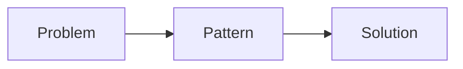

# Pattern Pattern 💠²

## Overview 📋
The Pattern Pattern describes how to effectively document and structure patterns to make them useful, maintainable, and approachable. It provides a consistent format for capturing knowledge, best practices, and solutions to recurring problems.

## What is a pattern? 💠

A pattern is a reusable solution template that addresses a common recurring problem in a specific context. Patterns capture proven practices, hard-won insights, and collective wisdom in a structured format that others can learn from and apply. By documenting patterns, we create a shared vocabulary and knowledge base that helps teams solve similar challenges consistently and effectively.

Patterns are more than just technical solutions - they represent a holistic approach that considers the context, constraints, tradeoffs and human factors involved. A good pattern explains not just what to do, but why, when, and how to apply the solution appropriately.

## Goals 🎯
- Create clear, understandable pattern documentation
- Ensure consistency across pattern descriptions
- Make patterns actionable and practical
- Enable easy discovery and reference
- Foster knowledge sharing and adoption

## Pattern Structure 📑

### Essential Elements

1. **Title and Emoji** 📌
   - Clear, descriptive name
   - Relevant emoji for visual recognition
   - Example: "# Docker Compose Service Pattern 🐋"

2. **Overview** 📋
   - Brief description (2-3 sentences)
   - Problem space addressed
   - Context where pattern applies

3. **Goals** 🎯
   - Specific objectives
   - Expected outcomes
   - Success criteria

4. **Core Content** 📚
   - Detailed implementation guidance
   - Code examples when applicable
   - Configuration samples
   - Visual diagrams where helpful

5. **Security Considerations** 🔐
   - Potential risks
   - Security best practices
   - Compliance requirements

6. **Anti-patterns** ⚠️
   - Common mistakes
   - What to avoid
   - Why they're problematic

7. **Best Practices** 💡
   - Proven approaches
   - Tips and tricks
   - Lessons learned

8. **Checklist** ✅
   - Implementation steps
   - Verification points
   - Quality criteria

9. **Related Patterns** 🔗
   - Links to complementary patterns
   - Prerequisites
   - Alternative approaches

## Writing Guidelines 📝

### Style
- Use clear, concise language
- Include practical examples
- Add relevant emojis for visual appeal
- Use headers for proper structure
- Include code blocks with syntax highlighting

### Code Examples
Include well-commented code examples and use appropriate syntax highlighting
````markdown
```python
# Simple hello world example
print("Hello World!")
```
````

### Diagrams
Use Mermaid or similar when helpful:
````markdown


````

## Anti-patterns to Avoid ⚠️
- ❌ Vague or abstract descriptions
- ❌ Missing practical examples
- ❌ Overcomplicated explanations
- ❌ Inconsistent formatting
- ❌ Outdated information
- ❌ Lack of context
- ❌ Missing security considerations

## Best Practices 💡
- Keep patterns focused and specific
- Include real-world examples
- Update when new insights are gained
- Cross-reference related patterns
- Use consistent formatting
- Add visuals where helpful
- Consider different expertise levels
- Maintain version history

## Implementation Checklist 📋

### Pattern Creation
- [ ] Choose clear pattern name
- [ ] Select relevant emoji
- [ ] Write concise overview
- [ ] Define specific goals
- [ ] Include practical examples
- [ ] Document security considerations
- [ ] List anti-patterns
- [ ] Add best practices
- [ ] Create implementation checklist
- [ ] Link related patterns

### Pattern Review
- [ ] Check formatting consistency
- [ ] Verify code examples
- [ ] Test links
- [ ] Validate diagrams
- [ ] Review for clarity
- [ ] Check for completeness

## Related Patterns 🔗
- [Cuteness Pattern 🌸](../practice/cuteness.md)

## Example Pattern Template 📄

```markdown
# Pattern Name emoji

## Overview 📋
[Brief description]

## Goals 🎯
- Goal 1
- Goal 2

## Implementation 🛠️
[Core content]

## Security Considerations 🔐
- Security point 1
- Security point 2

## Anti-patterns ⚠️
- Anti-pattern 1
- Anti-pattern 2

## Best Practices 💡
- Best practice 1
- Best practice 2

## Checklist 📋
- [ ] Step 1
- [ ] Step 2

## Related Patterns 🔗
- Pattern 1
- Pattern 2
```