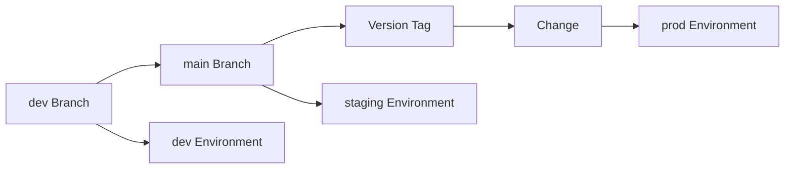

## Overview 📋

This pattern describes the three-stage deployment model: Development (dev), QA (staging), and Production (prod). Each stage serves specific purposes in the software development lifecycle and has distinct characteristics and requirements.

## Goals 🎯

- Clear separation of development, testing, and production workloads
- Consistent progression of changes through environments
- Reliable testing and QA processes
- Protected production environment
- Traceable deployments

## Stage Definitions 🔄

### Development (dev) 💻

**Purpose**: Active development and integration testing

#### Characteristics

- 🔧 Reflects current development state
- 🌿 Deployed from dev branches
- 🧪 Allows experimental features
- 🔄 Frequent updates
- 📦 Latest dependencies

#### Configuration

```yaml
# dev environment configuration
environment: development
debug: true
log_level: debug
feature_flags:
  experimental: enabled
```

### QA (staging) 🧪

**Purpose**: Quality assurance and pre-production verification

#### Characteristics

- 📊 Mirrors production setup
- 🔍 QA testing environment
- 📑 Production data copies (anonymized)
- 🌿 Deployed from main branch
- 🔄 Regular but controlled updates

#### Configuration

```yaml
# staging environment configuration
environment: staging
debug: false
log_level: info
feature_flags:
  experimental: configurable
```

### Production (prod) 🚀

**Purpose**: Live system serving real users

#### Characteristics

- ✅ Stable and verified code
- 🏷️ Deployed from version tags
- 🔒 Strict access control
- 📈 Production monitoring
- 🔐 Security hardening

#### Configuration

```yaml
# production environment configuration
environment: production
debug: false
log_level: warn
feature_flags:
  experimental: disabled
```

## Workflow 🔄

### Code Progression



### Database Handling

Database state is exported from production into the backup system. From there a backup is imported into a fresh staging environment.

## Access Control Matrix 🔐

| Resource | Dev | Staging | Production |
| -------- | --- | ------- | ---------- |
| Environment Access | 🔴 Only Team and Stakeholders | 🔴 Only Team and Stakeholders | 🟢 Users |
| Deployment trigger | 🟢 Dev-Branch Commit | 🟡 Signed maintainer commit after merge | 🔴 Signed Version Release |

## Quality Gates

### Development to Staging

- ✓ All tests passing
- ✓ Code review completed
- ✓ Main branch merge
- ✓ Automated deployment

### Staging to Production

- ✓ QA approval
- ✓ Performance testing
- ✓ Security scan
- ✓ Version tagged
- ✓ Release notes
- ✓ Deployment plan

## Anti-patterns to Avoid ⚠️

- ❌ Bypassing staging environment
- ❌ Using production data in development
- ❌ Manual configuration changes
- ❌ Inconsistent environments
- ❌ Direct production hotfixes

## Best Practices 💡

- 📦 Use infrastructure as code
- 🔄 Automate deployment processes
- 🔍 Maintain environment parity
- 📊 Regular staging refreshes
- 🔐 Strict access control
- 📝 Comprehensive logging
- 🎯 Feature flags for control

## Environment Setup Checklist 📋

1. [ ] Infrastructure provisioned
2. [ ] Security groups configured
3. [ ] Monitoring enabled
4. [ ] Backup strategy implemented
5. [ ] Access control configured
6. [ ] Deployment pipeline tested
7. [ ] Documentation updated

## Related Patterns 🔗

- 🔄 Deployment Pipeline
- 🔐 Access Control
- 📊 Monitoring Strategy
- 🗄️ Database Management
- 📝 Change Management
